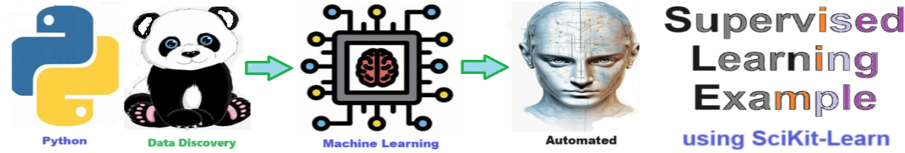

# Supervised Learning - A supervised learning example using SciKit-learn library.

## Description

Welcome to the solution **Supervised Learning** - an example for your projects

A supervised learning example using SciKit-learn library.
    
## Features
- Easy to understand and use  
- Easily Configurable 
- Quickly start your project with pre-built templates
- Its Fast and Automated
    
## Notebook Features
- Self Documenting 
- Self Testing 
- Easily Configurable
- Includes Talking Code - The code explains itself
- Self Logging 
- Self Debugging 
- Low Code - or - No Code
- Educational 
    
## Getting Started
To get started with the **Supervised Learning** solution, follow these steps:
1. Clone the repository to your local machine.
2. Install the required dependencies listed at the top of the notebook.
3. Explore the example code provided in the repository and experiment.
4. Run the notebook and your find your most Critical Data - EASY !
    

    